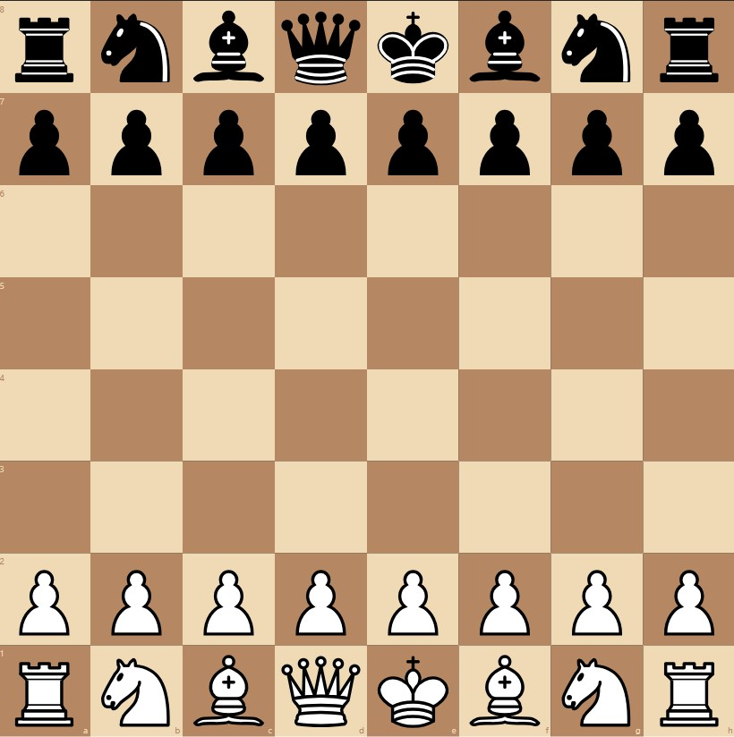

# ChessX ♟️

ChessX is a real-time, two-player online chess application built with React and Node.js, using WebSockets for live communication. It provides a clean and simple interface for users to connect and play a game of chess.



## Features

-   **Real-time Multiplayer:** Play against another person in real-time with moves updated instantly using WebSockets.
-   **Simple User Interface:** A clean and intuitive UI built with React and Tailwind CSS.
-   **Game State Logic:** Full chess logic powered by the `chess.js` library, handling valid moves, checks, checkmates, and draws.
-   **Interactive Chessboard:** A responsive and interactive board built with `react-chessboard`.
-   **Notifications:** Get notified for key game events like 'Check', 'Checkmate', 'Draw', or invalid moves using `react-hot-toast`.
-   **Move History:** Keep track of all the moves made during the game.

## Tech Stack

**Frontend:**
-   **Framework:** [React](https://reactjs.org/)
-   **Routing:** [React Router](https://reactrouter.com/)
-   **Styling:** [Tailwind CSS](https://tailwindcss.com/)
-   **Chessboard UI:** [react-chessboard](https://www.npmjs.com/package/react-chessboard)
-   **Chess Logic:** [chess.js](https://www.npmjs.com/package/chess.js)
-   **Notifications:** [React Hot Toast](https://react-hot-toast.com/)
-   **Build Tool:** [Vite](https://vitejs.dev/)

**Backend:**
-   **Runtime:** [Node.js](https://nodejs.org/)
-   **WebSockets:** [ws](https://www.npmjs.com/package/ws)
-   **Chess Logic:** [chess.js](https://www.npmjs.com/package/chess.js)
-   **Development:** [Nodemon](https://nodemon.io/)

## Getting Started

To get a local copy up and running, follow these simple steps.

### Prerequisites

Make sure you have Node.js and npm installed on your machine.
-   [Node.js](https://nodejs.org/en/download/) (which includes npm)

### Installation & Setup

1.  **Clone the repository:**
    ```sh
    git clone [https://github.com/1AmritOP/ChessX.git](https://github.com/1AmritOP/ChessX.git)
    cd ChessX
    ```

2.  **Set up the Backend:**
    Navigate to the `backend` directory, install dependencies, and start the server.
    ```sh
    cd backend
    npm install
    npm run dev
    ```
    The WebSocket server will start running on `ws://localhost:8080`.

3.  **Set up the Frontend:**
    Open a new terminal, navigate to the `frontend` directory, and install its dependencies.
    ```sh
    cd frontend
    npm install
    ```
    Create a `.env` file in the `frontend` directory and add the WebSocket server URL:
    ```
    VITE_BACKEND_URL=ws://localhost:8080
    ```
    Now, start the frontend development server:
    ```sh
    npm run dev
    ```
    The application will open in your browser, typically at `http://localhost:5173`.

### How to Play

1.  Open two separate browser tabs or windows and navigate to the application's URL.
2.  Click the **"Start Game"** button on both tabs.
3.  The backend will automatically pair the two clients, and the game will begin.
4.  The first player will be assigned 'white', and the second will be 'black'. You can now start playing!